# SpinPick Directus Schema - Mermaid Diagrams

This document provides detailed visualizations of the SpinPick database schema using Mermaid diagrams.

## Complete Schema Overview

This diagram shows all collections and their relationships in the SpinPick database schema:

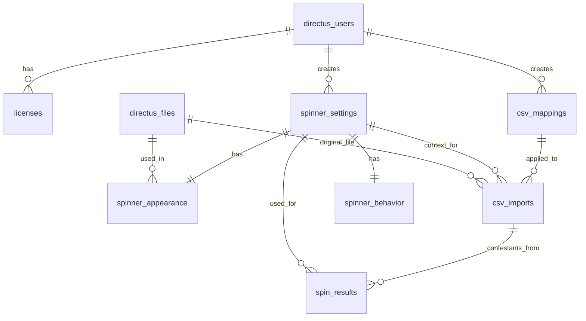

## Core Collection Relationship Diagram

This diagram shows the primary collections with their key fields:

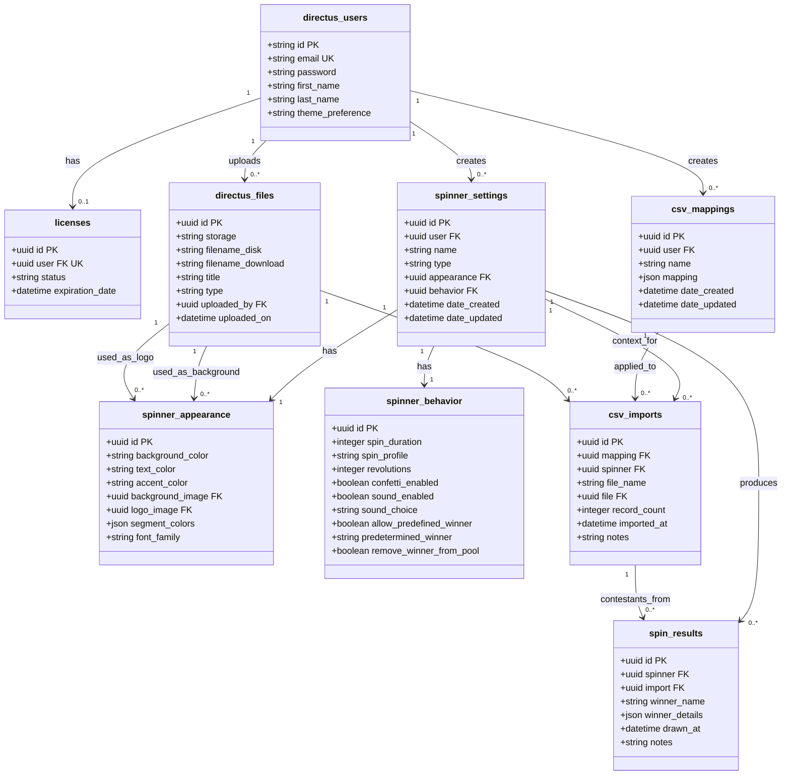

## User-Centered Relationships

This diagram focuses on the user perspective, showing all collections directly linked to a user:

```mermaid
erDiagram
    directus_users {
        uuid id PK
        string email UK
        string first_name
        string last_name
        string theme_preference
    }
    licenses {
        uuid id PK
        uuid user FK UK
        string status
        datetime expiration_date
    }
    spinner_settings {
        uuid id PK
        uuid user FK
        string name
        string type
    }
    csv_mappings {
        uuid id PK
        uuid user FK
        string name
        json mapping
    }
    directus_files {
        uuid id PK
        string title
        uuid uploaded_by FK
    }
    
    directus_users ||--o| licenses : "has"
    directus_users ||--o{ spinner_settings : "creates"
    directus_users ||--o{ csv_mappings : "creates"
    directus_users ||--o{ directus_files : "uploads"
```

## Spinner Configuration Hierarchy

This diagram shows the spinner configuration structure with appearance and behavior settings:

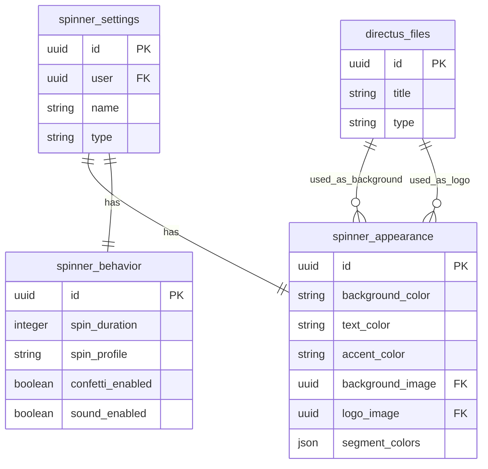

## CSV Import and Mapping Flow

This diagram illustrates how CSV mappings, imports, and results are connected:

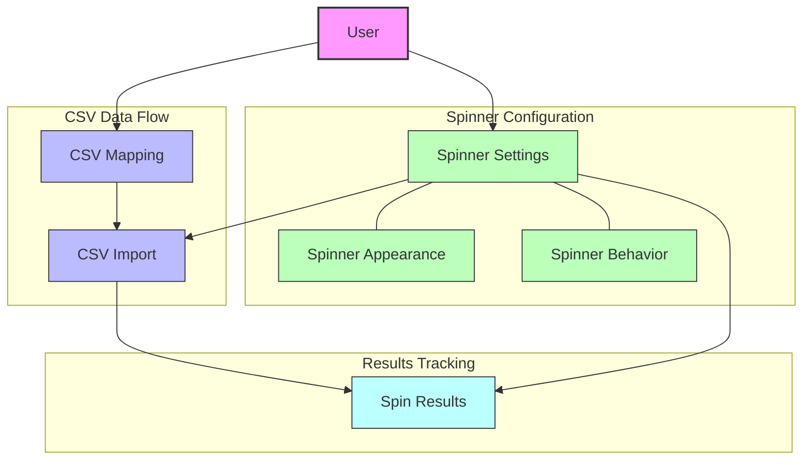

## Spin Results Relationships

This diagram focuses on the spin results collection and its relationships:

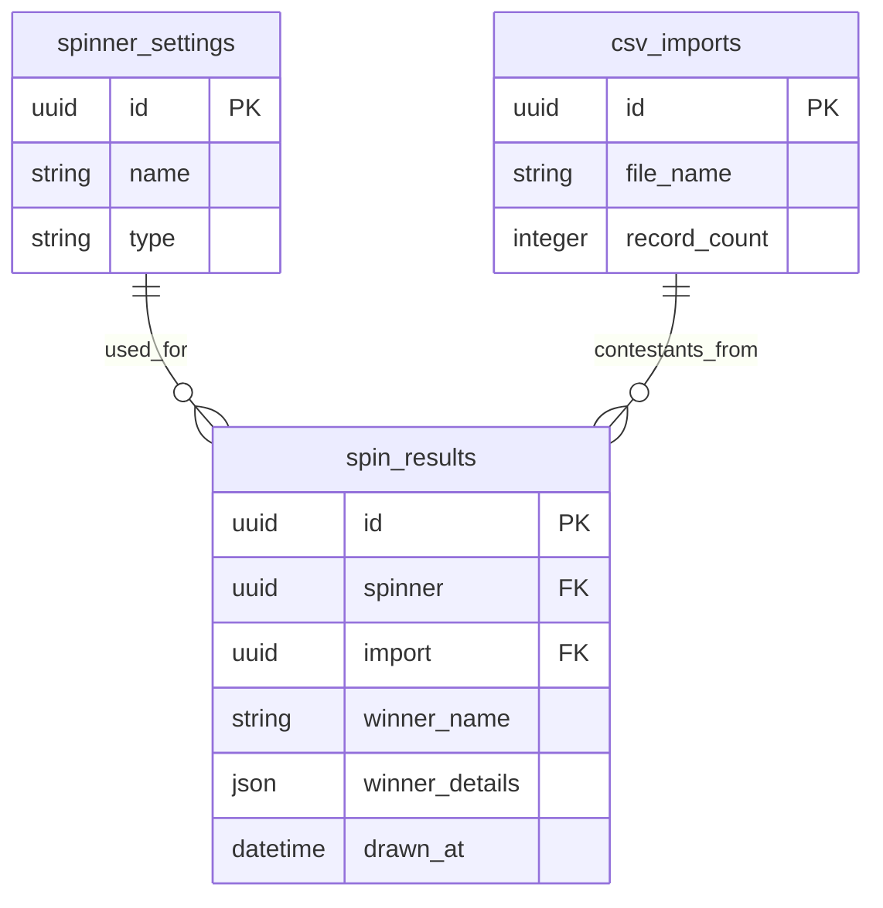

## License Management

This diagram shows the license management structure:

```mermaid
erDiagram
    directus_users {
        uuid id PK
        string email UK
        string first_name
        string last_name
    }
    licenses {
        uuid id PK
        uuid user FK UK
        string status
        datetime expiration_date
    }
    
    directus_users ||--o| licenses : "has"
```

## Data Flow for Spinner Operations

This sequence diagram illustrates the data flow during a typical spinner operation:

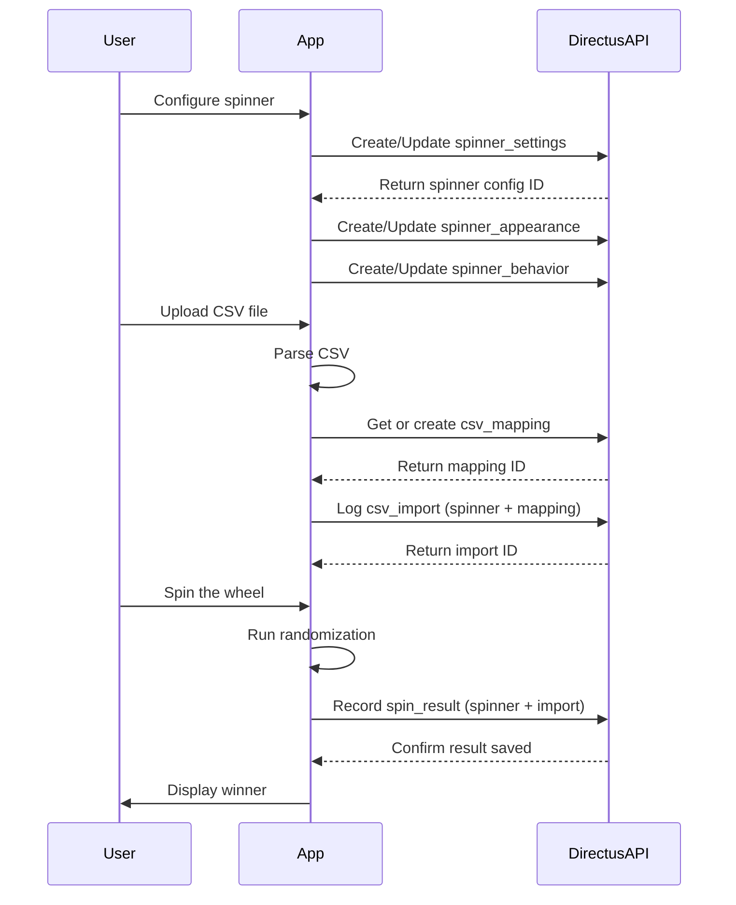

## File Storage and Usage

This diagram shows how files are stored and used in the system:

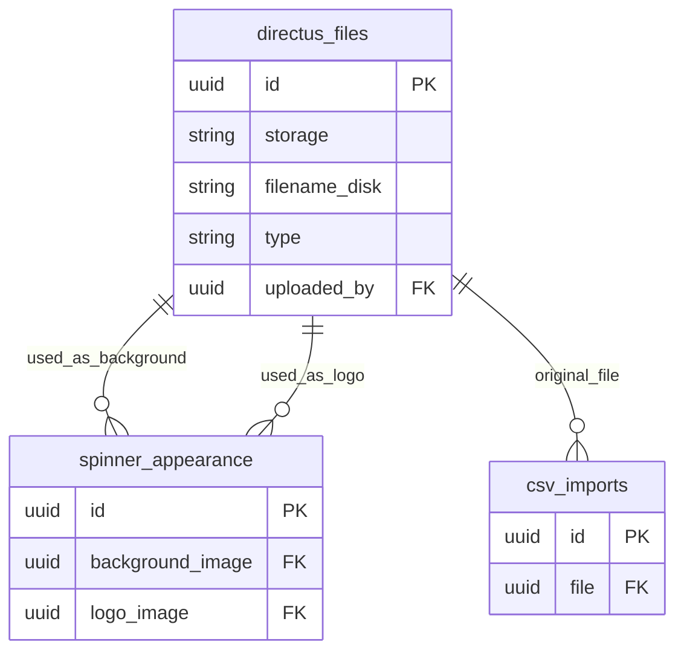

## Security and Access Control

This diagram illustrates the security structure with user permissions:

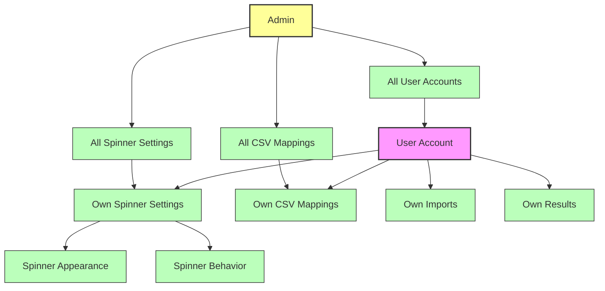

## Implementation Guidelines

This diagram provides an overview of how to implement the schema in Directus:

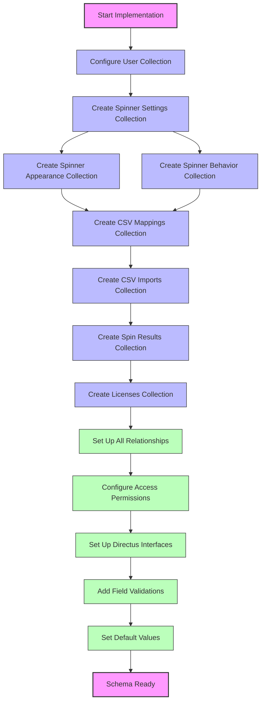

## Spinner Types and Customization Options

This diagram shows the different spinner types and their customization options:

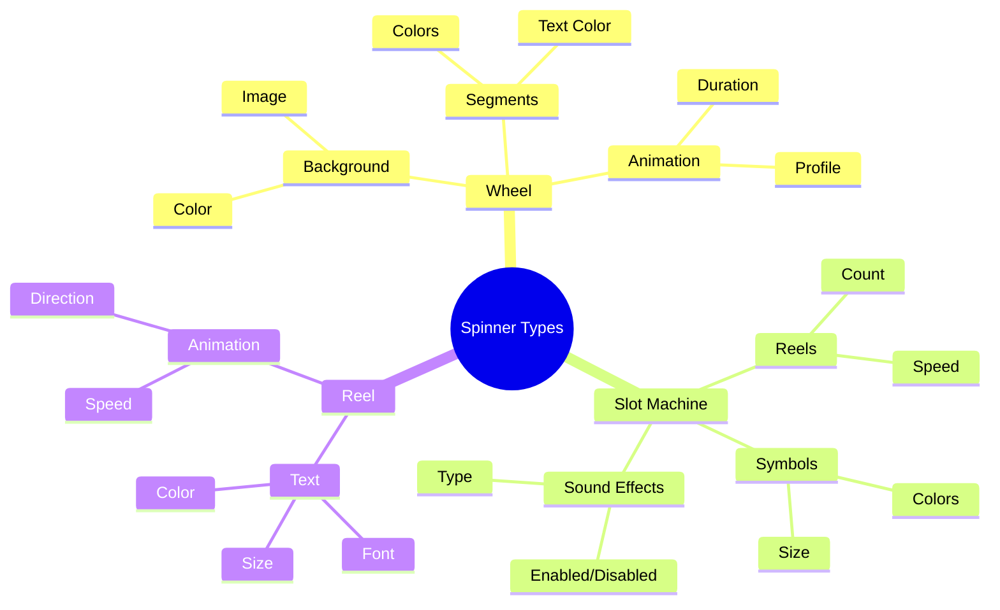

## CSV Mapping Structure

This diagram illustrates the structure of CSV mappings:

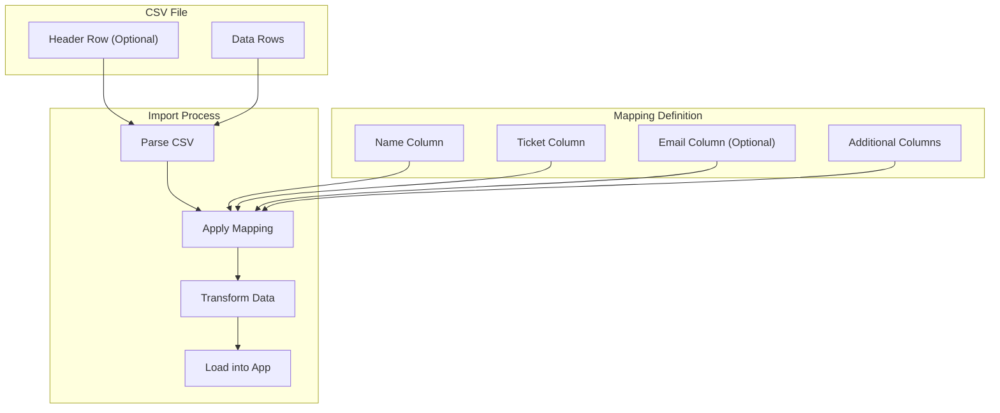

## Workflow: From Configuration to Results

This diagram shows the complete workflow from spinner configuration to results:

```mermaid
flowchart LR
    configure[Configure Spinner] --> customize[Customize Appearance]
    customize --> set_behavior[Set Behavior]
    set_behavior --> map_csv[Create CSV Mapping]
    map_csv --> import[Import Contestants]
    import --> spin[Spin for Winner]
    spin --> record[Record Result]
    record --> history[View History]
    
    subgraph "Spinner Setup"
        configure
        customize
        set_behavior
    end
    
    subgraph "Data Import"
        map_csv
        import
    end
    
    subgraph "Usage"
        spin
        record
        history
    end