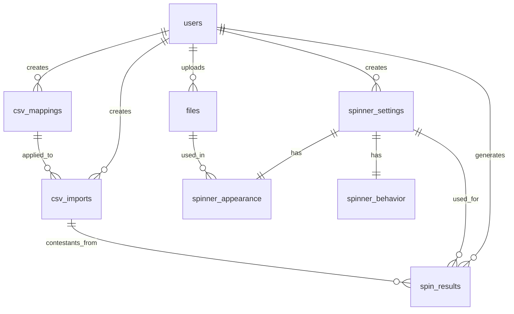
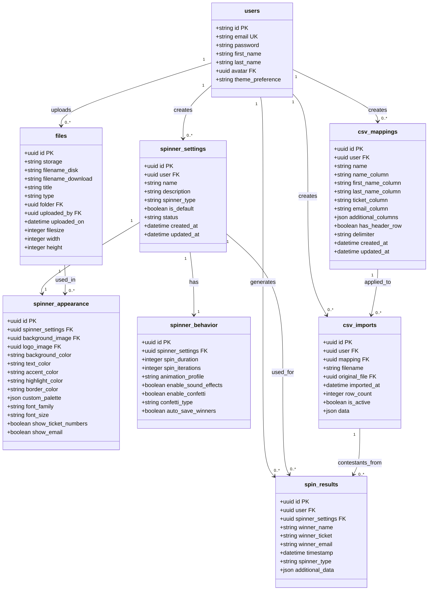

# SpinPick Directus Database Schema Design

This document provides a comprehensive definition of the database schema for the SpinPick application using Directus as the backend CMS and API layer.

## Table of Contents

1. [Overview](#overview)
2. [Schema Visualization](#schema-visualization)
3. [Collection Definitions](#collection-definitions)
4. [Relationship Mapping](#relationship-mapping)
5. [Field-Level Details](#field-level-details)
6. [Access Control & Permissions](#access-control--permissions)
7. [Migration & Implementation Notes](#migration--implementation-notes)

## Overview

SpinPick requires a comprehensive database schema to support:
- User customization preferences for different types of spinners
- CSV structure mapping for contestant data import
- Asset management for uploaded media (logos, backgrounds, etc.)
- Detailed spinner configuration options (appearance, behavior settings)
- Complete history of spin results for analytics and record-keeping

The database design follows a modular approach where settings are separated into logical groups, allowing for maximum flexibility and extensibility as new features are added.

## Schema Visualization

### High-Level Entity Relationship Diagram



### Detailed Relationship Model



## Collection Definitions

### 1. Users Collection (Built into Directus)

The users collection is provided by Directus and serves as the foundation for authentication and user management.

**Collection Name:** `directus_users`

**Fields:**
- `id` (uuid, primary key) - Unique identifier
- `email` (string, unique) - User email address for login
- `password` (hash) - Hashed password
- `first_name` (string) - User's first name
- `last_name` (string) - User's last name
- `avatar` (foreign key to files) - Profile image
- `theme_preference` (string) - UI theme preference ('light', 'dark', 'system')

**Relationships:**
- ONE-TO-MANY with `spinner_settings`
- ONE-TO-MANY with `csv_mappings`
- ONE-TO-MANY with `csv_imports`
- ONE-TO-MANY with `spin_results`
- ONE-TO-MANY with `files` (as uploaded_by)

**Notes:**
- Standard Directus user authentication applies
- Use roles and permissions to control access to SpinPick functionality
- Theme preference is used to initialize the UI theme

### 2. Spinner Settings Collection

The central collection for spinner configuration management. Each record represents a complete spinner configuration that can be switched between.

**Collection Name:** `spinner_settings`

**Fields:**
- `id` (uuid, primary key) - Unique identifier
- `user` (foreign key to users) - Owner of this configuration
- `name` (string, required) - User-defined name for this configuration
- `description` (text, optional) - Detailed description
- `spinner_type` (string, required) - Enum: 'wheel', 'simple-wheel', 'slot-machine', 'simple-slot', 'reel'
- `is_default` (boolean) - Whether this is the user's default configuration
- `status` (string) - Publication status ('published', 'draft')
- `created_at` (datetime) - When created
- `updated_at` (datetime) - When last updated

**Relationships:**
- MANY-TO-ONE with `users`
- ONE-TO-ONE with `spinner_appearance`
- ONE-TO-ONE with `spinner_behavior`
- ONE-TO-MANY with `spin_results`

**Notes:**
- Each user can have multiple spinner configurations
- Only one configuration per user can have `is_default = true`
- The `status` field allows users to save works in progress
- When creating a new configuration, appearance and behavior records should be created automatically

### 3. Spinner Appearance Collection

Stores all visual customization options for a spinner.

**Collection Name:** `spinner_appearance`

**Fields:**
- `id` (uuid, primary key) - Unique identifier
- `spinner_settings` (foreign key to spinner_settings, required) - Parent spinner settings
- `background_image` (foreign key to files, optional) - Background image
- `logo_image` (foreign key to files, optional) - Logo or watermark
- `background_color` (string) - CSS color for main background
- `text_color` (string) - CSS color for text elements
- `accent_color` (string) - CSS color for accent elements
- `highlight_color` (string) - CSS color for highlighted elements
- `border_color` (string) - CSS color for borders
- `custom_palette` (JSON array) - Array of colors for segments/items
- `font_family` (string, optional) - Custom font family
- `font_size` (string, optional) - Base font size
- `show_ticket_numbers` (boolean) - Whether to display ticket numbers
- `show_email` (boolean) - Whether to display email addresses

**Relationships:**
- ONE-TO-ONE with `spinner_settings` (inverse)
- MANY-TO-ONE with `files` as background_image
- MANY-TO-ONE with `files` as logo_image

**Notes:**
- Color values should be stored in CSS format (hex, rgb, rgba)
- Custom palette allows users to define segment colors for wheels, slots, etc.
- Font settings are optional and fall back to theme defaults
- This collection uses the same primary key value as its parent spinner_settings for easier joins

### 4. Spinner Behavior Collection

Stores all behavioral and animation settings for a spinner.

**Collection Name:** `spinner_behavior`

**Fields:**
- `id` (uuid, primary key) - Unique identifier
- `spinner_settings` (foreign key to spinner_settings, required) - Parent spinner settings
- `spin_duration` (integer) - Duration in milliseconds
- `spin_iterations` (integer) - Number of spins/iterations
- `animation_profile` (string) - Enum: 'gentle', 'normal', 'wild'
- `enable_sound_effects` (boolean) - Whether to play sounds
- `enable_confetti` (boolean) - Whether to show confetti on wins
- `confetti_type` (string) - Enum: 'default', 'explosion', 'cannon', 'fireworks', 'rain'
- `auto_save_winners` (boolean) - Whether to automatically save winners to history

**Relationships:**
- ONE-TO-ONE with `spinner_settings` (inverse)

**Notes:**
- Animation profiles define the easing curve for spinner animations
- Sound effects are toggled independently of other behaviors
- This collection uses the same primary key value as its parent spinner_settings for easier joins

### 5. CSV Mappings Collection

Defines how to interpret CSV files for contestant data import.

**Collection Name:** `csv_mappings`

**Fields:**
- `id` (uuid, primary key) - Unique identifier
- `user` (foreign key to users, required) - Owner of this mapping
- `name` (string, required) - Name for this mapping configuration
- `name_column` (string, required) - Column name for contestant name
- `first_name_column` (string, optional) - Column for first name if separate
- `last_name_column` (string, optional) - Column for last name if separate
- `ticket_column` (string, required) - Column for ticket number
- `email_column` (string, optional) - Column for email address
- `additional_columns` (JSON) - Mapping of additional CSV columns to app fields
- `has_header_row` (boolean) - Whether CSVs have headers
- `delimiter` (string) - Character used in CSV (usually comma)
- `created_at` (datetime) - When created
- `updated_at` (datetime) - When last updated

**Relationships:**
- MANY-TO-ONE with `users`
- ONE-TO-MANY with `csv_imports`

**Notes:**
- Users can have multiple mappings for different CSV formats
- The additional_columns field stores a JSON object mapping CSV columns to app fields
- Separating first/last name from full name allows flexible imports

### 6. CSV Imports Collection

Tracks imported CSV files and their data.

**Collection Name:** `csv_imports`

**Fields:**
- `id` (uuid, primary key) - Unique identifier
- `user` (foreign key to users, required) - Owner of this import
- `mapping` (foreign key to csv_mappings, required) - Mapping used for this import
- `filename` (string) - Original filename
- `original_file` (foreign key to files, optional) - The imported file
- `imported_at` (datetime) - When the import occurred
- `row_count` (integer) - Number of rows/contestants imported
- `is_active` (boolean) - Whether this is the current active contestant list
- `data` (JSON, optional) - Cached import data for faster retrieval

**Relationships:**
- MANY-TO-ONE with `users`
- MANY-TO-ONE with `csv_mappings`
- MANY-TO-ONE with `files` as original_file
- ONE-TO-MANY with `spin_results` (implicit relationship through data)

**Notes:**
- Only one import per user should have `is_active = true`
- The data field provides a cache to avoid reparsing the CSV
- Original file allows re-downloading if needed

### 7. Files Collection (Built into Directus)

Handles file uploads for backgrounds, logos, etc.

**Collection Name:** `directus_files`

**Fields:**
- `id` (uuid, primary key) - Unique identifier
- `storage` (string) - Storage driver used
- `filename_disk` (string) - Actual filename on disk
- `filename_download` (string) - Filename presented for downloads
- `title` (string) - User-friendly title
- `type` (string) - MIME type
- `folder` (foreign key) - Organizational folder
- `uploaded_by` (foreign key to users) - User who uploaded
- `uploaded_on` (datetime) - Upload timestamp
- `filesize` (integer) - Size in bytes
- `width` (integer) - For images
- `height` (integer) - For images

**Relationships:**
- MANY-TO-ONE with `users` as uploaded_by
- ONE-TO-MANY with `spinner_appearance` as background_image
- ONE-TO-MANY with `spinner_appearance` as logo_image
- ONE-TO-MANY with `csv_imports` as original_file

**Notes:**
- Standard Directus file handling applies
- Image-specific metadata is used for spinner backgrounds and logos
- Folders can be used to organize files by purpose

### 8. Spin Results Collection

Tracks history of spin results for analytics and reference.

**Collection Name:** `spin_results`

**Fields:**
- `id` (uuid, primary key) - Unique identifier
- `user` (foreign key to users, required) - Owner of this result
- `spinner_settings` (foreign key to spinner_settings, optional) - Configuration used
- `winner_name` (string, required) - Name of the winner
- `winner_ticket` (string, required) - Ticket number of the winner
- `winner_email` (string, optional) - Email of the winner if available
- `timestamp` (datetime) - When the spin occurred
- `spinner_type` (string) - Type of spinner used
- `additional_data` (JSON, optional) - Any extra data about the spin

**Relationships:**
- MANY-TO-ONE with `users`
- MANY-TO-ONE with `spinner_settings`
- Implicit relationship with `csv_imports` through winner data

**Notes:**
- Results are always tied to a user but not always to spinner settings
- Legacy results might not have spinner_settings references
- Additional_data can store things like spin parameters, animations used, etc.

## Relationship Mapping

This section details the specific nature of relationships between collections.

### Primary Relationships

1. **Users to Spinner Settings** (ONE-TO-MANY)
   - Foreign Key: `spinner_settings.user` → `users.id` 
   - Cascade: Delete spinner settings when user is deleted
   - Access: A user can only access their own spinner settings

2. **Spinner Settings to Appearance** (ONE-TO-ONE)
   - Foreign Key: `spinner_appearance.spinner_settings` → `spinner_settings.id`
   - Cascade: Delete appearance record when spinner settings are deleted
   - Implementation: Use same ID value in both tables
   - Access: Accessed together with spinner settings

3. **Spinner Settings to Behavior** (ONE-TO-ONE)
   - Foreign Key: `spinner_behavior.spinner_settings` → `spinner_settings.id`
   - Cascade: Delete behavior record when spinner settings are deleted
   - Implementation: Use same ID value in both tables
   - Access: Accessed together with spinner settings

4. **Users to CSV Mappings** (ONE-TO-MANY)
   - Foreign Key: `csv_mappings.user` → `users.id`
   - Cascade: Delete mappings when user is deleted
   - Access: A user can only access their own CSV mappings

5. **CSV Mappings to CSV Imports** (ONE-TO-MANY)
   - Foreign Key: `csv_imports.mapping` → `csv_mappings.id`
   - Cascade: No automatic deletion (preserve import history)
   - Access: Accessed through mapping or directly by user

6. **Users to Files** (ONE-TO-MANY)
   - Foreign Key: `files.uploaded_by` → `users.id`
   - Cascade: No automatic deletion (preserve files)
   - Access: Upload permission control via Directus

7. **Files to Spinner Appearance** (ONE-TO-MANY)
   - Foreign Keys: 
     - `spinner_appearance.background_image` → `files.id`
     - `spinner_appearance.logo_image` → `files.id`
   - Cascade: No cascade (preserve files)
   - Access: Via spinner settings

8. **Users to Spin Results** (ONE-TO-MANY)
   - Foreign Key: `spin_results.user` → `users.id`
   - Cascade: Delete results when user is deleted
   - Access: A user can only access their own spin results

9. **Spinner Settings to Spin Results** (ONE-TO-MANY)
   - Foreign Key: `spin_results.spinner_settings` → `spinner_settings.id`
   - Cascade: No cascade (preserve historical results)
   - Access: Via user or direct query

10. **CSV Imports to Spin Results** (Implicit)
    - Not a direct foreign key relationship
    - Connected through the contestant data stored in both
    - Used for tracking which import a winner came from

### Special Relationship Cases

1. **Default Spinner Configuration**
   - Only one spinner_settings per user can have `is_default = true`
   - Implemented via application logic or database constraint
   - When changing default, must update other configurations

2. **Active Contestant List**
   - Only one csv_import per user can have `is_active = true`
   - Implemented via application logic or database constraint
   - When changing active list, must update other imports

3. **Shared Assets**
   - Files can be referenced by multiple spinner appearances
   - Care must be taken when deleting files that may be in use

## Field-Level Details

This section provides in-depth details about specific fields that need special attention.

### Spinner Types

The `spinner_type` field in `spinner_settings` accepts these values:
- `wheel` - The advanced spinning wheel with customizable segments
- `simple-wheel` - Basic spinning wheel with minimal options
- `slot-machine` - Slot machine with multiple columns
- `simple-slot` - Basic slot machine with one column
- `reel` - Text-based reel animation (using react-reel)

Each type has different customization options supported by the appearance and behavior settings.

### Animation Profiles

The `animation_profile` field in `spinner_behavior` accepts these values:
- `gentle` - Smooth easing with a gentle stop (cubic-bezier(0.27, 0.57, 0.21, 0.9))
- `normal` - Standard balanced animation (cubic-bezier(0.17, 0.67, 0.21, 1))
- `wild` - Exaggerated animation with bounce (cubic-bezier(0.05, 0.85, 0.15, 1.15))

These profiles affect the animation curve for spinner motion.

### Confetti Types

The `confetti_type` field in `spinner_behavior` accepts these values:
- `default` - Standard centered confetti burst
- `explosion` - 360-degree particle explosion
- `cannon` - Directional confetti stream
- `fireworks` - Multiple bursts with timing variations
- `rain` - Confetti dropping from top of screen

Each type creates a different celebration effect when a winner is selected.

### Custom Palette Format

The `custom_palette` field in `spinner_appearance` stores an array of color values:

```json
[
  "#FF5733",
  "#33FF57",
  "#3357FF",
  "#F3FF33",
  "#FF33F3"
]
```

These colors are used sequentially for wheel segments, slot items, or other elements that need distinct colors.

### Additional Columns Format

The `additional_columns` field in `csv_mappings` stores a JSON object mapping CSV column names to application field names:

```json
{
  "phone": "contact_phone",
  "address": "mailing_address",
  "registration_date": "signup_date",
  "notes": "admin_notes"
}
```

This allows for flexible extension of contestant data.

## Access Control & Permissions

### Directus Roles

1. **Administrator**
   - Full access to all collections
   - Can manage users and roles
   - Can create system-wide defaults

2. **User**
   - Can create and manage their own:
     - Spinner Settings (and related appearance/behavior)
     - CSV Mappings and Imports
     - Spin Results
   - Can upload files
   - Cannot access other users' data

### Field-Level Permissions

- Users should not be able to modify the `user` field in any collection
- Creation timestamp fields should be read-only
- Status fields may have controlled transitions

## Migration & Implementation Notes

### Creating the Schema

When implementing this schema in Directus:

1. Create collections in this order to avoid foreign key issues:
   - spinner_settings
   - spinner_appearance
   - spinner_behavior
   - csv_mappings
   - csv_imports
   - spin_results

2. Set up relationships using the Directus interface
   - Use M2O (many-to-one) relationship types for foreign keys
   - Use O2M (one-to-many) relationship types for inverse lookups

3. Configure default values:
   - Set default animation profile to 'normal'
   - Set default confetti type to 'explosion'
   - Set default spin duration to 5000ms

### Data Validation Rules

Implement these validation rules in Directus or in application code:

1. Spinner Settings:
   - Name is required and unique per user
   - Spinner type must be from allowed values

2. Appearance:
   - Colors should be valid CSS color values
   - Custom palette should be a valid JSON array

3. Behavior:
   - Spin duration should be between 1000-10000ms
   - Spin iterations should be between 1-50

4. CSV Mappings:
   - Name and ticket columns are required
   - Delimiter must be a single character

### Application Integration Considerations

When integrating with your application:

1. **Caching Strategy**
   - Cache spinner settings locally after fetching
   - Update cache when settings change

2. **Offline Support**
   - Store active spinner settings in localStorage
   - Queue results to sync when connection is restored

3. **User Experience**
   - Provide sensible defaults for all settings
   - Group related settings together in the UI

4. **Extension Points**
   - The schema is designed to be extended with new spinner types
   - Additional fields can be added to any collection

5. **Performance**
   - Use Directus filtering to fetch only needed fields
   - Consider implementing field-specific permissions to reduce payload size