# Revised Directus Schema for SpinPick Chrome Extension

## Overview

SpinPick's Directus schema is designed to maximize user customization and control while maintaining an intuitive structure and high performance. All data is organized into **Directus-native collections** with clear separation of concerns. Each collection serves a distinct purpose (e.g., spinner configurations, visual settings, import history) and is linked via relationships for data integrity and easy querying.

### Complete Schema Overview

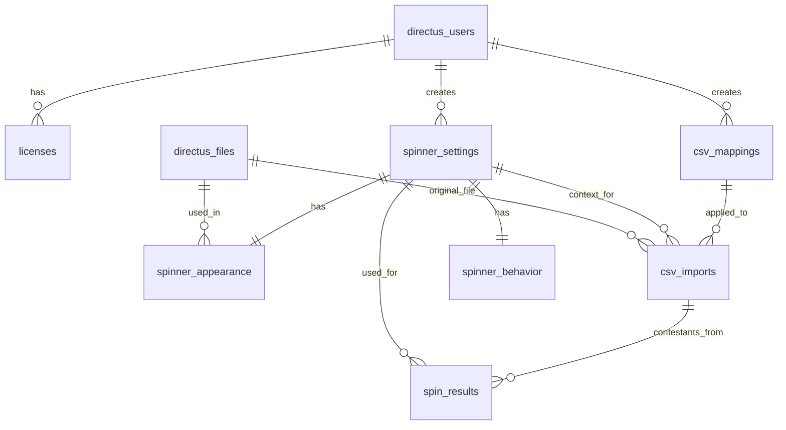

**Key Relationships at a Glance:**

* **User ⟶ Spinner Settings:** Each user can create multiple spinner configurations; every spinner configuration is owned by one user.
* **User ⟶ CSV Mappings:** Each user can have many CSV column mapping definitions.
* **Spinner Settings ⟷ Appearance/Behavior:** One-to-one relationships separate visual and behavioral options for clarity (each spinner config has a unique appearance and behavior record).
* **Spinner Settings ⟶ Spin Results:** Each spinner configuration can produce many spin result records (e.g., each spin outcome is logged under the config used).
* **CSV Mappings ⟶ CSV Imports:** Each mapping can be used for multiple data imports (an import log references which mapping was applied).
* **Files ⟶ Spinner Appearance:** Image files (from Directus Files) can be attached to many spinner appearance records (for logos, backgrounds, etc.).

### Core Collection Relationship Diagram

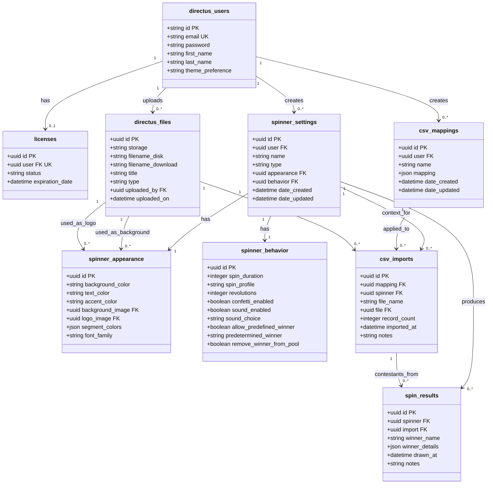

## Directus Built-in Collections

The schema leverages standard Directus collections for core functionality:

* **`directus_users`** – Manages user accounts for authentication
* **`directus_files`** – Used for storing media assets (images, etc.)

### User-Centered Relationships

```mermaid
erDiagram
    directus_users {
        uuid id PK
        string email UK
        string first_name
        string last_name
        string theme_preference
    }
    licenses {
        uuid id PK
        uuid user FK UK
        string status
        datetime expiration_date
    }
    spinner_settings {
        uuid id PK
        uuid user FK
        string name
        string type
    }
    csv_mappings {
        uuid id PK
        uuid user FK
        string name
        json mapping
    }
    directus_files {
        uuid id PK
        string title
        uuid uploaded_by FK
    }
    
    directus_users ||--o| licenses : "has"
    directus_users ||--o{ spinner_settings : "creates"
    directus_users ||--o{ csv_mappings : "creates"
    directus_users ||--o{ directus_files : "uploads"
```

## Custom Collections and Field Definitions

### 1. **Licenses**

**Purpose:** Manage user licensing and subscription status for the extension.

```mermaid
erDiagram
    directus_users {
        uuid id PK
        string email UK
        string first_name
        string last_name
    }
    licenses {
        uuid id PK
        uuid user FK UK
        string status
        datetime expiration_date
    }
    
    directus_users ||--o| licenses : "has"
```

**Fields:**

* `id` (UUID, primary key) – Unique identifier for each license record
* `user` (many-to-one, relation to **directus_users**, **unique**) – The Directus user that this license belongs to
* `status` (string; e.g., *enum*: `"active"` or `"inactive"`) – Current status of the license
* `expiration_date` (datetime) – The date and time when the license expires

**Design Rationale:** This separate **Licenses** collection cleanly decouples licensing from user profiles. By relating each license to a user and enforcing uniqueness, we ensure one license per user for data consistency. This structure is scalable for many users and can be extended (for example, adding fields like `plan_type` or `license_key` in the future) without impacting other schema parts.

### 2. **Spinner Settings**

**Purpose:** The core collection for spinner configurations. Each record represents a saved randomizer setup.

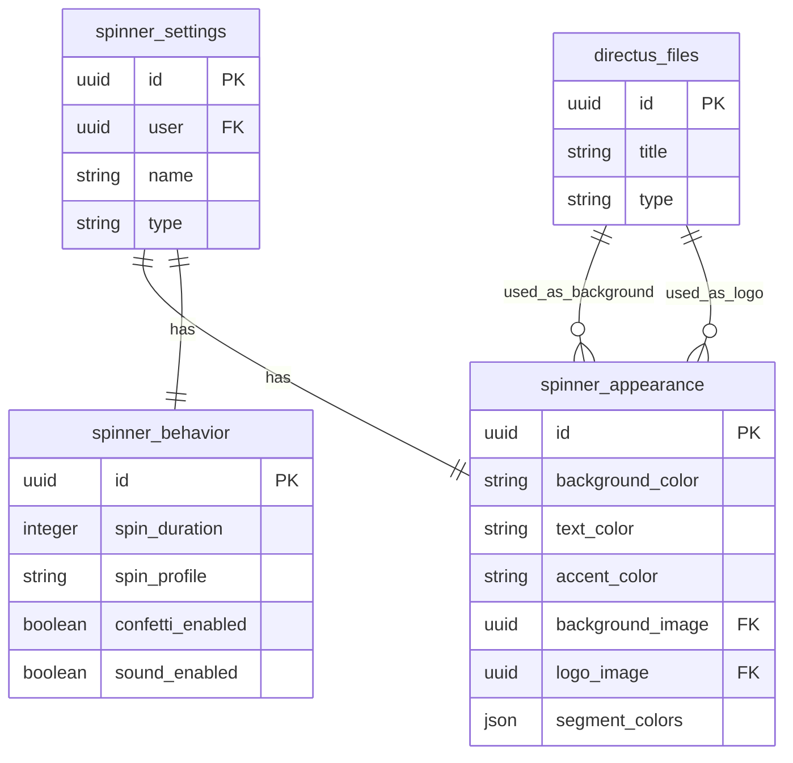

**Fields:**

* `id` (UUID, primary key) – Unique identifier for the spinner configuration
* `user` (many-to-one, relation to **directus_users**) – Reference to the owner
* `name` (string) – A human-friendly name for the configuration
* `type` (string or enum) – The type of randomizer component for this config
* `appearance` (many-to-one, relation to **Spinner Appearance**, one-to-one) 
* `behavior` (many-to-one, relation to **Spinner Behavior**, one-to-one)
* `date_created` / `date_updated` (timestamps)
* `created_by` / `updated_by` (relations to directus_users)

**Design Rationale:** The **Spinner Settings** collection is the central hub of the schema. By including a `user` relation, the design naturally supports multi-user data isolation. The separation of `appearance` and `behavior` into related collections keeps this core table lean and focused, benefiting performance and clarity. The `type` field future-proofs the schema: as new spinner types are added, the same schema can accommodate them without altering the structure.

### 3. **Spinner Appearance**

**Purpose:** Store **visual customization options** for a spinner. This includes stylistic settings like colors, images, and other aesthetic details.

**Fields:**

* `id` (UUID, primary key) – Unique identifier for the appearance record
* `background_color` (string, color hex code) – Background color for the spinner interface or wheel
* `text_color` (string, color) – Primary text or label color used on the spinner
* `accent_color` (string, color) – Accent color for highlights, borders, or other UI accents
* `background_image` (many-to-one, relation to **directus_files**) – Optional background image
* `logo_image` (many-to-one, relation to **directus_files**) – Optional logo or overlay image
* `segment_colors` (JSON or array) – **Optional:** Array of color values for individual segments
* `font_family` (string) – **Optional:** Font or typography setting for labels
* `spinner_settings` (one-to-one inverse relation to **Spinner Settings**)

**Design Rationale:** The **Spinner Appearance** collection isolates all purely visual settings, making the schema more intuitive. This separation means that heavy media fields (like images) and less-frequently-changed style options are only fetched when needed. The use of JSON for `segment_colors` allows flexibility in handling variable-length color lists without needing another related collection, keeping complexity manageable.

### 4. **Spinner Behavior**

**Purpose:** Define the **animation and interaction settings** for a spinner. This includes how the spinner operates independent of its look.

**Fields:**

* `id` (UUID, primary key) – Unique identifier for the behavior record
* `spin_duration` (integer or decimal) – The duration of the spin animation in seconds
* `spin_profile` (string, enum) – The spin acceleration/deceleration profile
* `revolutions` (integer) – **Optional:** Number of revolutions or spins before stopping
* `confetti_enabled` (boolean) – Whether to show a confetti animation when a winner is selected
* `sound_enabled` (boolean) – Whether to play a sound effect upon spin completion
* `sound_choice` (string) – **Optional:** Which sound to play (if multiple are available)
* `allow_predefined_winner` (boolean) – **Optional:** Allows the user to rig a winner
* `predetermined_winner` (string) – **Optional:** The identifier of a predetermined winner
* `remove_winner_from_pool` (boolean) – **Optional:** Whether to remove winners from subsequent spins
* `spinner_settings` (one-to-one inverse relation to **Spinner Settings**)

**Design Rationale:** The **Spinner Behavior** collection encapsulates all functional aspects, enabling advanced customization of how the randomizer behaves without mixing these fields with appearance or basic info. This separation aligns with the principle of separation of concerns: users can tweak how the spinner *feels* independently from how it *looks*.

### 5. **CSV Mappings**

**Purpose:** Define how to interpret columns from an imported CSV of participants. This collection stores mapping templates that map CSV file columns to the fields needed by the spinner.

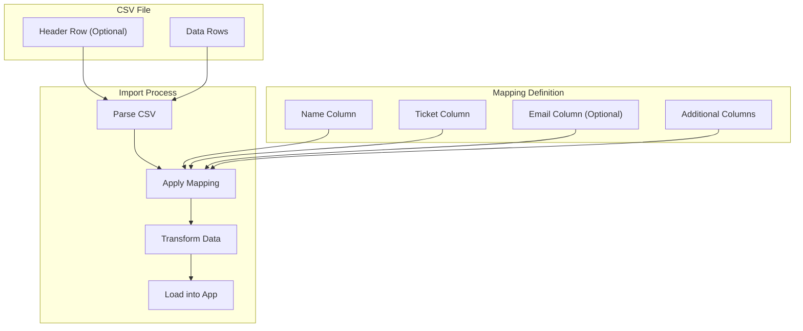

**Fields:**

* `id` (UUID, primary key) – Unique identifier for the mapping definition
* `user` (many-to-one, relation to **directus_users**) – Owner of the mapping
* `name` (string) – A friendly name for the mapping template
* `mapping` (JSON) – A JSON object or array that defines the column mapping rules
* `date_created` / `date_updated` – Timestamps for when this mapping was created or modified

**Design Rationale:** Storing CSV mapping rules in a **JSON field** provides maximum flexibility to handle arbitrary column layouts, fulfilling the goal of maximizing user customization. Instead of a rigid table structure for every possible column position or name, a JSON allows each user's mapping to capture exactly what they need for their CSV format.

### 6. **CSV Imports**

**Purpose:** Log records of CSV files that have been imported (uploaded) into the system for a draw.

**Fields:**

* `id` (UUID, primary key) – Unique identifier for the import event record
* `mapping` (many-to-one, relation to **CSV Mappings**) – The mapping definition used
* `spinner` (many-to-one, relation to **Spinner Settings**) – The spinner configuration used
* `file_name` (string) – The name of the CSV file that was imported
* `file` (many-to-one, relation to **directus_files**) – **Optional:** Link to the uploaded file
* `record_count` (integer) – The number of participant entries contained in the CSV
* `imported_at` (datetime) – Timestamp of when the import occurred
* `notes` (text) – **Optional:** Any additional notes or comments about the import

**Design Rationale:** The **CSV Imports** collection serves as an audit log and reference for data loading events. By linking each import to a mapping, we know exactly how the data was interpreted, and by linking to a spinner (the context), we know for which configuration or event the data was intended.

### 7. **Spin Results**

**Purpose:** Record the outcomes of spins (the winners and related info) for historical tracking and analytics.

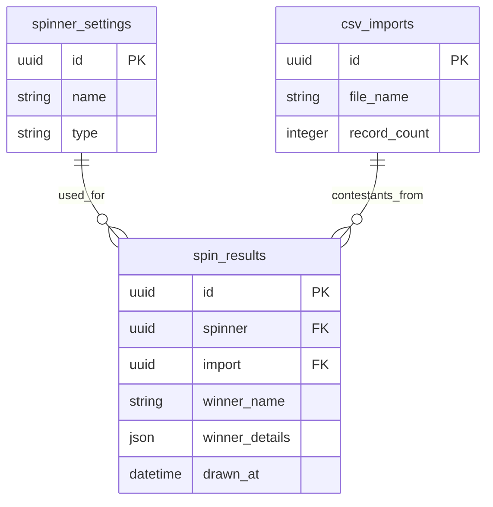

**Fields:**

* `id` (UUID, primary key) – Unique identifier for the spin result record
* `spinner` (many-to-one, relation to **Spinner Settings**) – The spinner configuration used
* `import` (many-to-one, relation to **CSV Imports**, *nullable*) – The import event associated
* `winner_name` (string) – The name of the winner selected in the spin
* `winner_details` (JSON) – **Optional:** Additional details about the winner
* `drawn_at` (datetime) – Timestamp of when the spin was conducted
* `notes` (text) – **Optional:** Any notes about the result

**Design Rationale:** The **Spin Results** collection is streamlined to store only what is necessary for history and basic statistics. We intentionally **do not store full participant lists** here – only the winner info – which protects participant privacy and keeps the data volume low.

## Data Flow for Spinner Operations

This sequence diagram illustrates the data flow during a typical spinner operation:

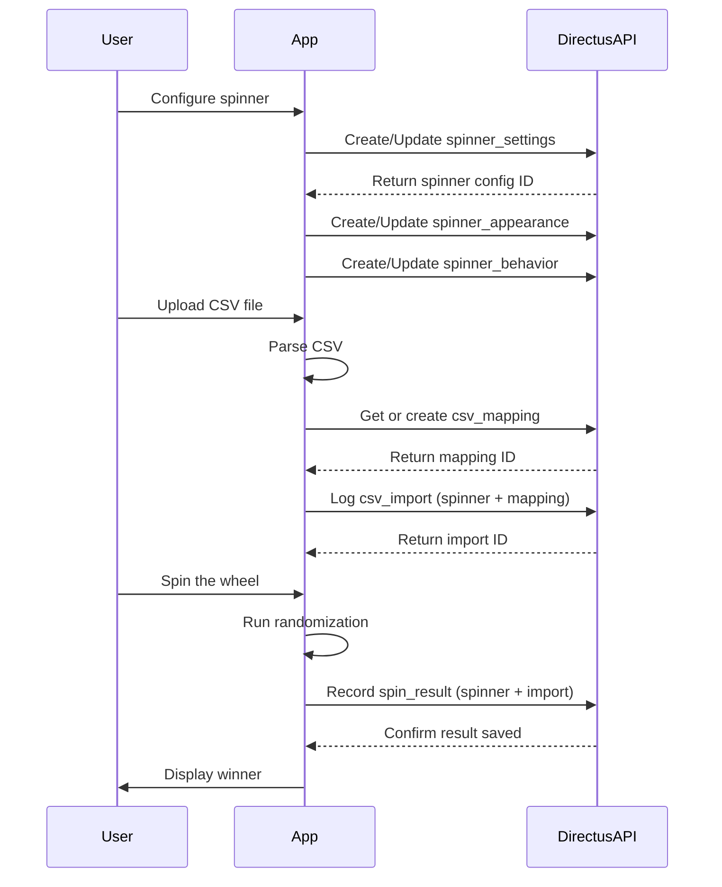

## Relationships & Integrity Constraints

The collections are linked to ensure **data integrity** and logical consistency:

### Security and Access Control

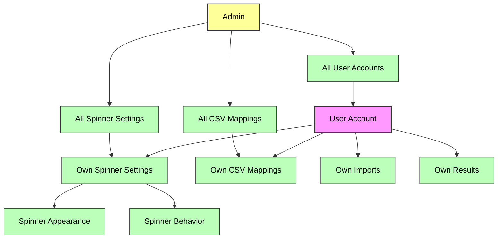

* **User Ownership:** All primary entities have a direct or indirect link to the `directus_users` table. Using Directus' permission system with these relations ensures users can only access their own records.

* **One-to-One Relations:** The pairs (Spinner Settings ↦ Spinner Appearance) and (Spinner Settings ↦ Spinner Behavior) are implemented by treating the foreign keys in Spinner Settings as unique relationships.

* **One-to-Many / Many-to-One:** Relations like User → Spinner Settings, User → CSV Mappings, etc., ensure foreign keys exist and point to valid records.

* **Unique License per User:** The Licenses collection uses a unique constraint on the `user` field to ensure a user cannot have two active license records.

* **Data Consistency:** By linking records like spin_results to spinner and import, and import to mapping, we inherently tie all these to a single user, maintaining data integrity.

## Spinner Types and Customization Options

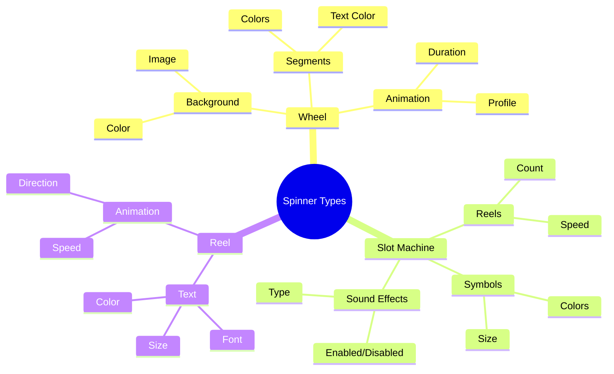

## Workflow: From Configuration to Results

```mermaid
flowchart LR
    configure[Configure Spinner] --> customize[Customize Appearance]
    customize --> set_behavior[Set Behavior]
    set_behavior --> map_csv[Create CSV Mapping]
    map_csv --> import[Import Contestants]
    import --> spin[Spin for Winner]
    spin --> record[Record Result]
    record --> history[View History]
    
    subgraph "Spinner Setup"
        configure
        customize
        set_behavior
    end
    
    subgraph "Data Import"
        map_csv
        import
    end
    
    subgraph "Usage"
        spin
        record
        history
    end
    
    classDef setupClass fill:#f9f,stroke:#333,stroke-width:1px,color:#000
    classDef importClass fill:#bbf,stroke:#333,stroke-width:1px,color:#000
    classDef usageClass fill:#bfb,stroke:#333,stroke-width:1px,color:#000
    
    class configure,customize,set_behavior setupClass
    class map_csv,import importClass
    class spin,record,history usageClass
```

## Implementation Guidelines

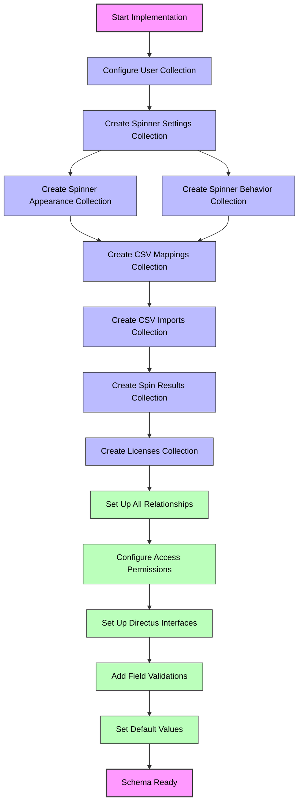

## Scalability, Flexibility, and Maintainability Considerations

This refactored schema is built with long-term use in mind, balancing **normalized structure** and **pragmatic denormalization** where appropriate:

* **Scalability:** Each collection can grow independently without impacting others. Key fields used for lookups are indexed by default, ensuring that even with growth, queries remain efficient.

* **Flexibility:** The schema leverages flexible field types (like JSON) to accommodate a wide variety of use-cases without requiring schema changes for each variation. The separation of concerns means each aspect can be modified or extended in isolation.

* **Clarity and Intuitive Structure:** Each collection has a single, clear responsibility. Collections and fields are named clearly, which reduces ambiguity.

* **Performance Optimizations:** Because the schema remains fully Directus-native, we can leverage Directus features like caching and relation expansion. Heavy data (like lists of participants) never travel to the API except in aggregate form, keeping interactions snappy.

* **Maintainability:** This schema is self-descriptive, which aids maintenance. Future developers or admins can look at the collections and immediately grasp their purpose from the names and field definitions.

## CSV Import and Mapping Flow

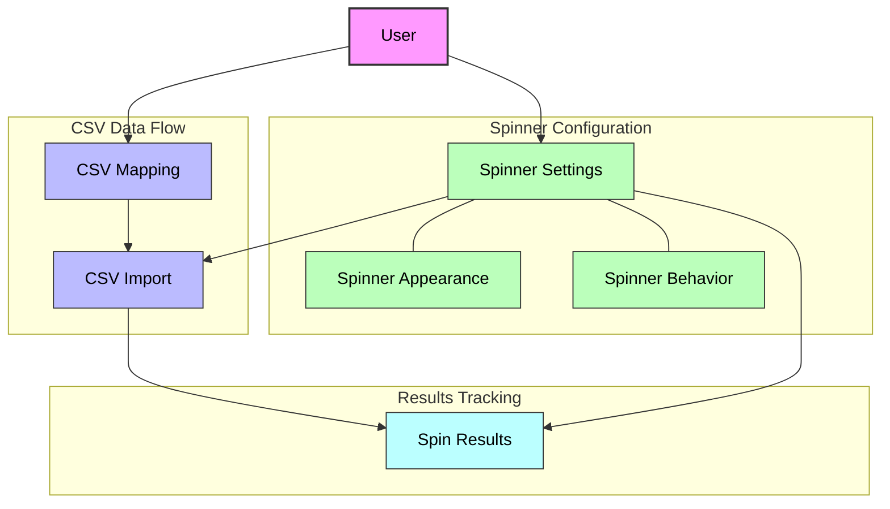

## File Storage and Usage

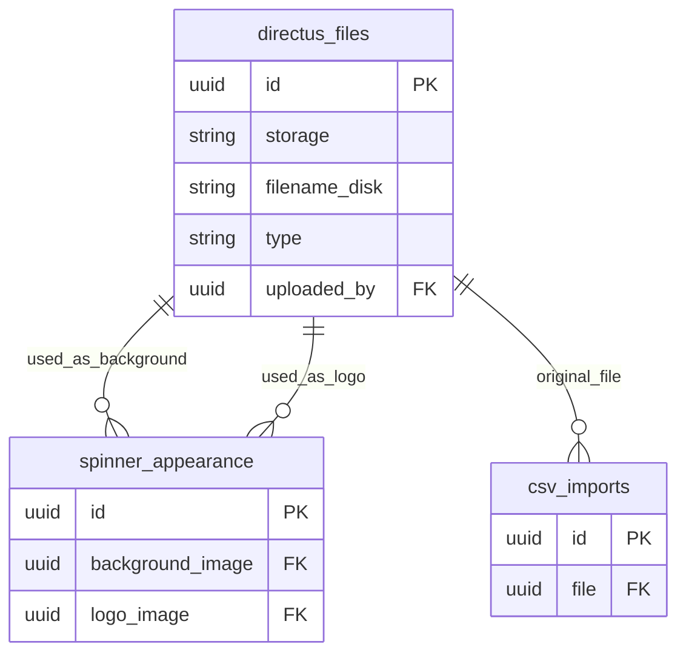

In conclusion, the refactored Directus schema for SpinPick achieves a clean separation of functionality: **Licensing**, **User Configurations**, **Visual/Behavioral customization**, **Data Import mappings**, and **Result logging**. Each part is optimized for its role, and together they form a cohesive system that is **scalable**, **flexible**, **clear**, and **maintainable**.