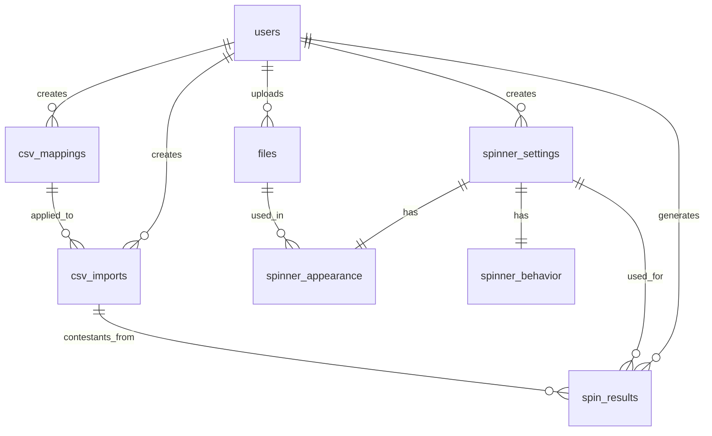
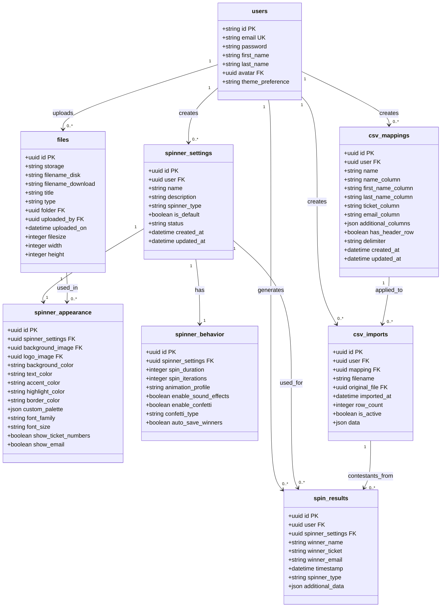
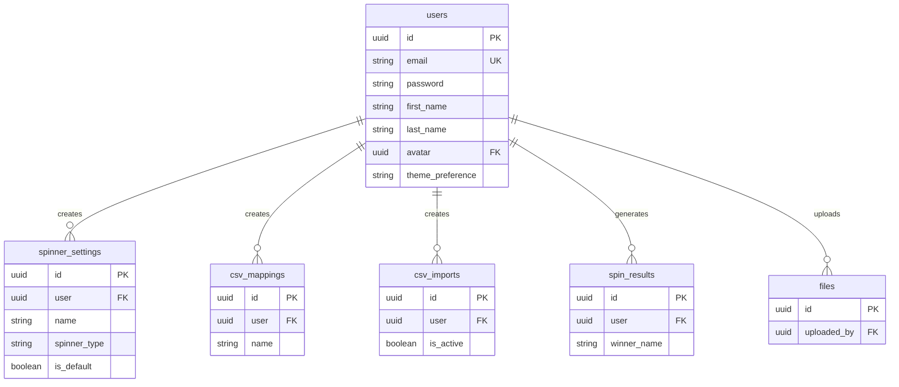
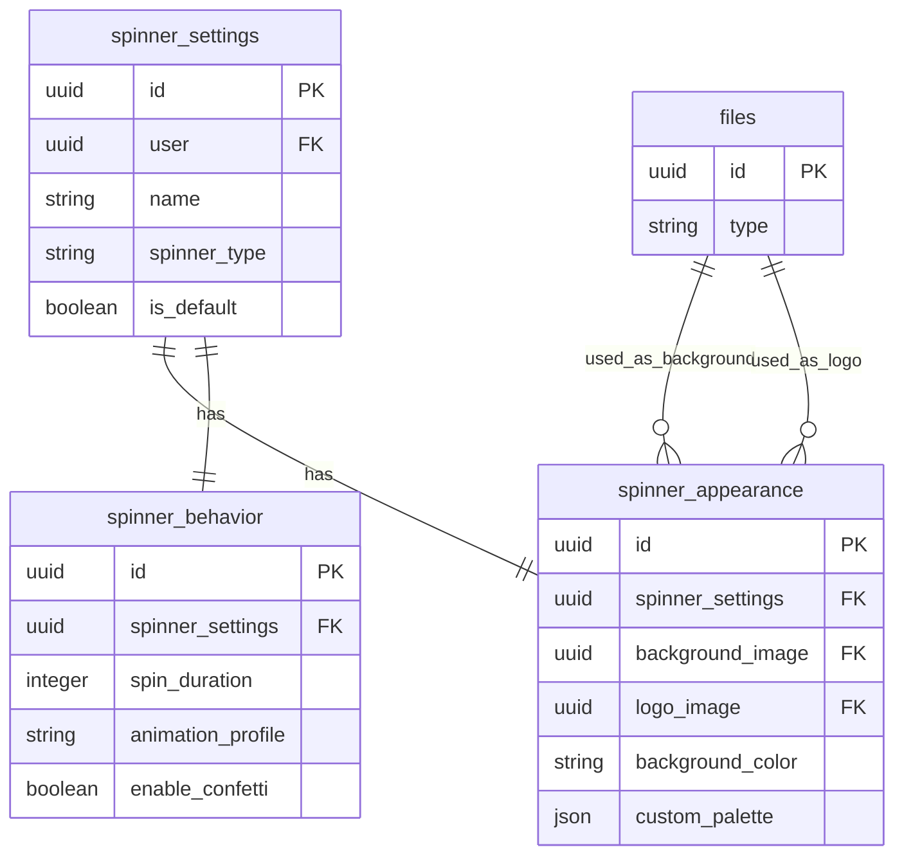
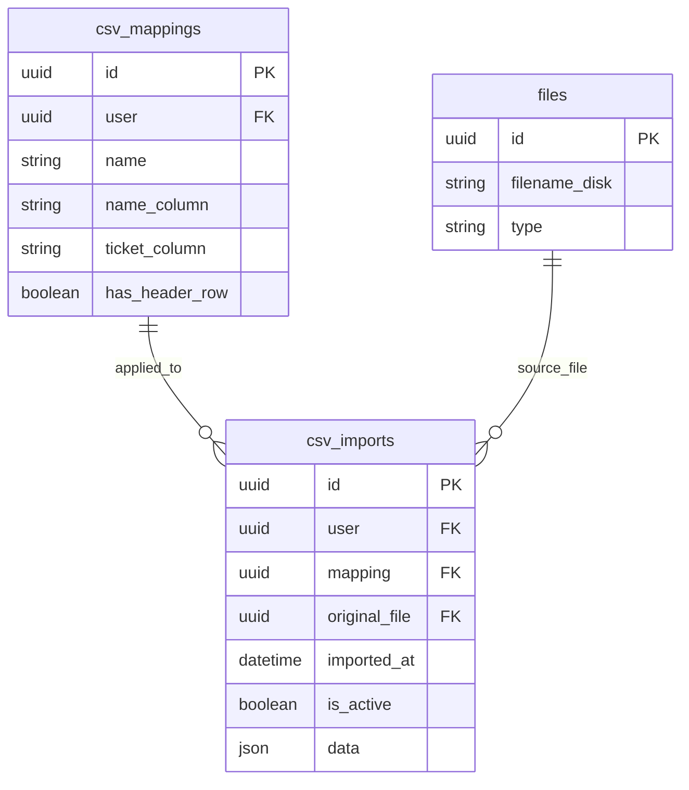
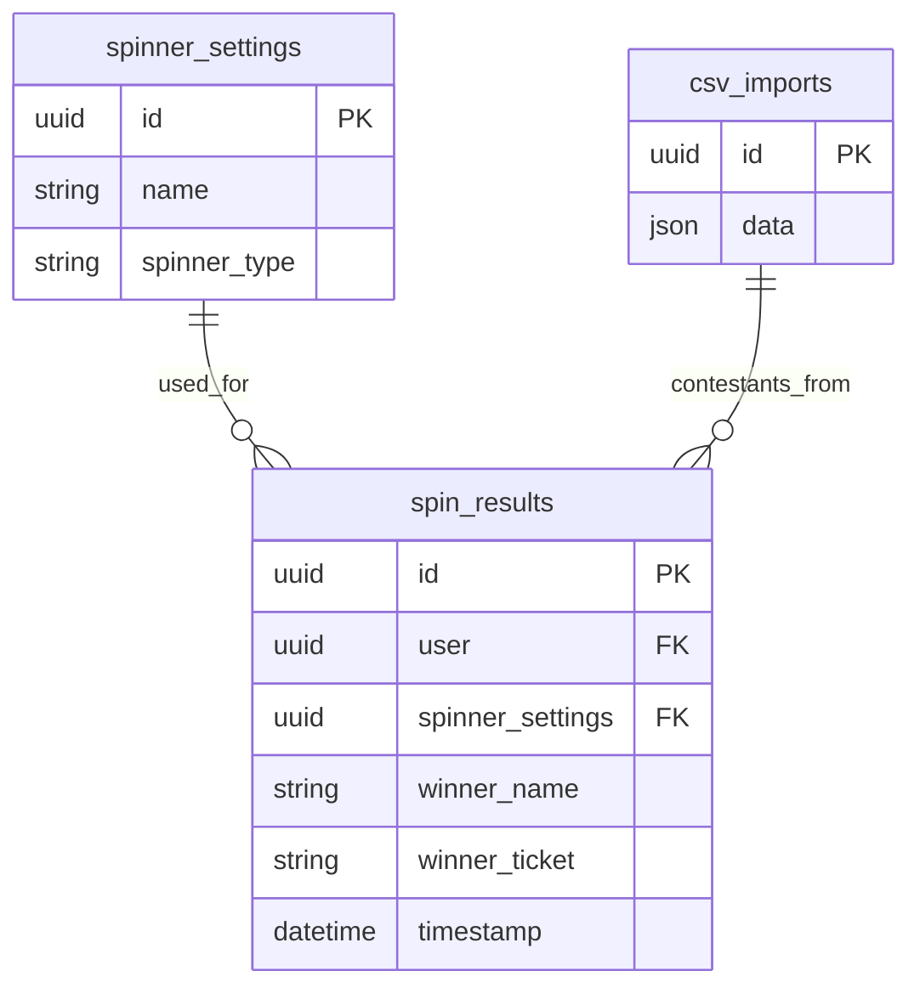

# SpinPick Directus Database Schema Design (Refactored)

This document provides a comprehensive definition of the database schema for the SpinPick application using Directus as the backend CMS and API layer, with enhanced visual diagrams for better understanding.

## Table of Contents

1. [Overview](#overview)
2. [Complete Schema Visualization](#complete-schema-visualization)
3. [Individual Relationship Diagrams](#individual-relationship-diagrams)
4. [Collection Definitions](#collection-definitions)
5. [Implementation Guidelines](#implementation-guidelines)

## Overview

SpinPick requires a robust database schema to support multiple features:

- User customization preferences for different types of spinners (wheel, slot machine, reel)
- CSV structure mapping for contestant data import
- Asset management for uploaded media (logos, backgrounds)
- Detailed spinner configuration options (appearance, behavior settings)
- Complete history of spin results for analytics and record-keeping

The database design follows a modular approach where settings are separated into logical groups, allowing for maximum flexibility and extensibility.

## Complete Schema Visualization

### Entity Relationship Overview



### Detailed Entity Relationship Diagram with Fields



## Individual Relationship Diagrams

### User-Centered Relationships



### Spinner Configuration Relationships



### CSV Data Import Relationships



### Spin Results Relationships



## Collection Definitions

### 1. Users Collection

Provided by Directus, this is the foundation for authentication and user management.

**Collection Name:** `directus_users`

**Key Fields:**
- `id` (uuid, PK) - Unique identifier
- `email` (string, unique) - User email address
- `first_name`, `last_name` (string) - User's name
- `theme_preference` (string) - UI preference ('light', 'dark', 'system')

**Relationships:**
- ONE-TO-MANY with `spinner_settings`, `csv_mappings`, `csv_imports`, `spin_results`, `files`

### 2. Spinner Settings Collection

The central collection for spinner configuration management.

**Collection Name:** `spinner_settings`

**Key Fields:**
- `id` (uuid, PK) - Unique identifier
- `user` (uuid, FK) - Owner of this configuration
- `name` (string) - User-defined configuration name
- `spinner_type` (string) - Type of spinner ('wheel', 'simple-wheel', 'slot-machine', 'simple-slot', 'reel')
- `is_default` (boolean) - Whether this is the user's default configuration

**Relationships:**
- MANY-TO-ONE with `users`
- ONE-TO-ONE with `spinner_appearance` and `spinner_behavior`
- ONE-TO-MANY with `spin_results`

### 3. Spinner Appearance Collection

Visual customization options for a spinner.

**Collection Name:** `spinner_appearance`

**Key Fields:**
- `id` (uuid, PK) - Same as parent spinner_settings.id
- `spinner_settings` (uuid, FK) - Parent spinner settings
- `background_image`, `logo_image` (uuid, FK) - Optional images
- Color fields: `background_color`, `text_color`, `accent_color`, etc.
- `custom_palette` (JSON array) - Colors for segments/items
- Display options: `show_ticket_numbers`, `show_email`

**Relationships:**
- ONE-TO-ONE with `spinner_settings`
- MANY-TO-ONE with `files` (for background and logo)

### 4. Spinner Behavior Collection

Animation and interaction settings for a spinner.

**Collection Name:** `spinner_behavior`

**Key Fields:**
- `id` (uuid, PK) - Same as parent spinner_settings.id
- `spinner_settings` (uuid, FK) - Parent spinner settings 
- `spin_duration` (integer) - Duration in milliseconds
- `animation_profile` (string) - Animation style ('gentle', 'normal', 'wild')
- Sound and visual effects: `enable_sound_effects`, `enable_confetti`, `confetti_type`

**Relationships:**
- ONE-TO-ONE with `spinner_settings`

### 5. CSV Mappings Collection

Defines how to interpret CSV files for contestant data import.

**Collection Name:** `csv_mappings`

**Key Fields:**
- `id` (uuid, PK) - Unique identifier
- `user` (uuid, FK) - Owner of this mapping
- `name` (string) - Name for this mapping configuration
- Column mappings: `name_column`, `ticket_column`, etc.
- `additional_columns` (JSON) - Extended column mappings
- Import configuration: `has_header_row`, `delimiter`

**Relationships:**
- MANY-TO-ONE with `users`
- ONE-TO-MANY with `csv_imports`

### 6. CSV Imports Collection

Tracks imported CSV files and their data.

**Collection Name:** `csv_imports`

**Key Fields:**
- `id` (uuid, PK) - Unique identifier
- `user`, `mapping` (uuid, FK) - Owner and mapping used
- `original_file` (uuid, FK) - The imported file
- `imported_at` (datetime) - Import timestamp
- `is_active` (boolean) - Current active contestant list
- `data` (JSON) - Cached import data

**Relationships:**
- MANY-TO-ONE with `users`, `csv_mappings`, `files`
- ONE-TO-MANY with `spin_results` (implicit)

### 7. Files Collection

Handles file uploads for backgrounds, logos, etc. Provided by Directus.

**Collection Name:** `directus_files`

**Key Fields:**
- Standard Directus file fields
- `uploaded_by` (uuid, FK) - User who uploaded

**Relationships:**
- MANY-TO-ONE with `users`
- ONE-TO-MANY with various file reference fields

### 8. Spin Results Collection

Tracks history of spin results for analytics and reference.

**Collection Name:** `spin_results`

**Key Fields:**
- `id` (uuid, PK) - Unique identifier
- `user`, `spinner_settings` (uuid, FK) - Owner and configuration used
- Winner data: `winner_name`, `winner_ticket`, `winner_email`
- `timestamp` (datetime) - When the spin occurred
- `spinner_type` (string) - Type of spinner used
- `additional_data` (JSON) - Any extra data

**Relationships:**
- MANY-TO-ONE with `users` and `spinner_settings`
- Implicit relationship with `csv_imports`

## Implementation Guidelines

### Creating Collections in Directus

1. **Creation Order:** Follow this sequence to avoid FK issues:
   ```
   users → spinner_settings → spinner_appearance/behavior → csv_mappings → csv_imports → spin_results
   ```

2. **Relationship Configuration:**
   - For 1:1 relations: use the same ID in both tables
   - For 1:M relations: use standard foreign keys
   - Configure cascading deletes where appropriate

3. **Default Values:**
   - `spinner_type`: 'wheel'
   - `animation_profile`: 'normal'
   - `spin_duration`: 5000ms
   - `enable_confetti`: true
   - `confetti_type`: 'explosion'

### API Integration Best Practices

1. **Fetching Configurations:**
   ```typescript
   // Example API call to get a complete spinner configuration
   const getSpinnerConfig = async (id: string) => {
     const settings = await directus.items('spinner_settings').readOne(id, {
       fields: ['*', 'appearance.*', 'behavior.*']
     });
     return settings;
   };
   ```

2. **Creating New Configurations:**
   ```typescript
   // Example API call to create a new spinner configuration
   const createSpinnerConfig = async (config: SpinnerConfig) => {
     // First create the settings
     const settings = await directus.items('spinner_settings').createOne({
       user: currentUser.id,
       name: config.name,
       spinner_type: config.type,
       is_default: config.isDefault
     });
     
     // Then create appearance and behavior with the same ID
     await directus.items('spinner_appearance').createOne({
       id: settings.id,
       spinner_settings: settings.id,
       background_color: config.backgroundColor,
       // other appearance fields...
     });
     
     await directus.items('spinner_behavior').createOne({
       id: settings.id,
       spinner_settings: settings.id,
       spin_duration: config.spinDuration,
       // other behavior fields...
     });
     
     return settings.id;
   };
   ```

3. **Recording Spin Results:**
   ```typescript
   // Example API call to record a spin result
   const recordSpinResult = async (result: SpinResult) => {
     await directus.items('spin_results').createOne({
       user: currentUser.id,
       spinner_settings: result.configId,
       winner_name: result.winner.name,
       winner_ticket: result.winner.ticket,
       winner_email: result.winner.email,
       timestamp: new Date().toISOString(),
       spinner_type: result.spinnerType
     });
   };
   ```

### Field Validation Rules

1. **Spinner Settings:**
   - `spinner_type` must be one of: 'wheel', 'simple-wheel', 'slot-machine', 'simple-slot', 'reel'
   - `name` must be unique per user

2. **Appearance:**
   - Color values should be valid CSS color strings
   - Image references should be valid file IDs

3. **Behavior:**
   - `spin_duration` must be between 1000-10000ms
   - `animation_profile` must be one of: 'gentle', 'normal', 'wild'
   - `confetti_type` must be one of: 'default', 'explosion', 'cannon', 'fireworks', 'rain'

4. **CSV Mappings:**
   - `name_column` and `ticket_column` are required
   - `delimiter` must be a single character

5. **Imported Data Structure:**
   The `data` field in `csv_imports` should store an array of contestant objects:
   ```json
   [
     {
       "id": "unique-id-1",
       "name": "John Doe",
       "ticket": "A12345",
       "email": "john@example.com",
       "additionalFields": {
         "phone": "555-1234",
         "company": "Acme Inc"
       }
     },
     // More contestants...
   ]
   ```

### Access Control Guidelines

1. **User Permissions:**
   - Users should only access their own data
   - Implement row-level security using Directus roles

2. **Default Constraints:**
   - Only one spinner configuration per user can be default
   - Only one CSV import per user can be active

3. **System Defaults:**
   - Provide system-wide default spinner configurations
   - Allow admin to set organization-wide defaults