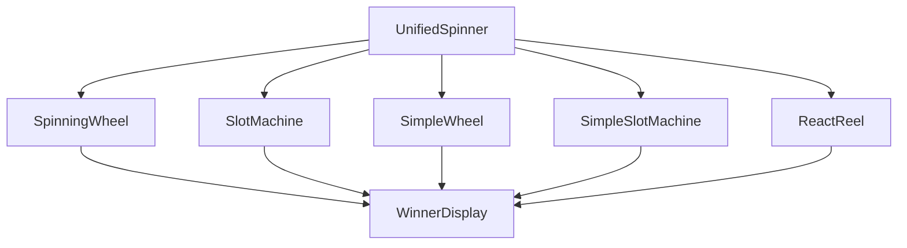
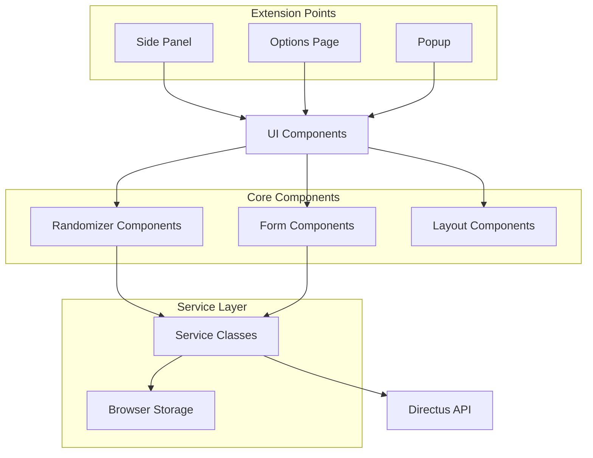
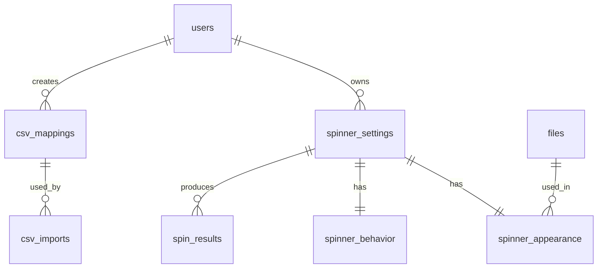

# SpinPick Chrome Extension

SpinPick is the ultimate randomizer built for modern raffle companies and creative giveaways. Whether you prefer the charm of a spinning wheel, the thrill of a slot machine, or the suspense of shuffling name cards, SpinPick lets you customize your draw with professional polish and visual flair.

## Table of Contents

- [Features](#features)
- [Spinner Components](#spinner-components)
- [Project Architecture](#project-architecture)
- [Authentication and Licensing](#authentication-and-licensing)
- [Directus Integration](#directus-integration)
- [Development](#development)
- [Extension Structure](#extension-structure)
- [Code Organization](#code-organization)
- [Technologies](#technologies)
- [Contributing](#contributing)
- [License](#license)

## Features

- **Multiple Randomizer Types**: Choose from Spinning Wheel, Slot Machine, Reel Animation, and more
- **Full Customization**: Customize every visual and behavioral aspect of your randomizers
- **CSV Import**: Import contestant data from CSV files with flexible column mapping
- **Theming Support**: Light, dark, and system modes for optimal user experience
- **Chrome Extension Integration**: Access via popup, options page, and side panel
- **Responsive Design**: Works on any screen size
- **Results History**: Track and review past randomizer outcomes
- **Static Fallback**: Vanilla JavaScript fallback implementation for guaranteed compatibility
- **Directus Authentication**: Secure license validation through Directus CMS
- **Save Configurations**: Save and load your favorite spinner configurations

## Spinner Components

SpinPick provides multiple randomizer components to suit different visual preferences and use cases. Each component can be fully customized and configured through the Options page.

### Component Overview



### 1. SpinningWheel

A fully customizable spinning wheel with segments that can be colored, sized, and animated with various effects.

**Key Features:**
- Dynamic segment generation based on contestant data
- Configurable spin duration and revolutions
- Three animation profiles: gentle, normal, and wild
- Optional predetermined winners
- Confetti and sound effects on winner selection
- Theme integration with customizable colors
- Responsive sizing (small, medium, large)

**Usage Example:**
```tsx
<SpinningWheel
  segments={[
    { id: '1', label: 'John Smith', color: '#FF5733' },
    { id: '2', label: 'Jane Doe', color: '#33FF57' },
    { id: '3', label: 'Bob Johnson', color: '#3357FF' }
  ]}
  onSpinEnd={(winner) => console.log(`Winner: ${winner.label}`)}
  size="lg"
  spinDuration={5000}
  spinRevolutions={5}
  spinProfile="wild"
  enableSoundEffects={true}
  enableConfetti={true}
  confettiType="fireworks"
  theme="default"
/>
```

### 2. SlotMachine

A multi-column slot machine that spins to reveal random selections from a list of contestants.

**Key Features:**
- Single or multiple column configuration
- Independent or synchronized column spinning
- Configurable spin speed and iterations
- Sequential or simultaneous stopping
- Theme integration with customizable colors
- Sound effects for authentic slot machine experience

**Usage Example:**
```tsx
<SlotMachine
  columns={[
    ['John Smith', 'Jane Doe', 'Bob Johnson'],
    ['Ticket #123', 'Ticket #456', 'Ticket #789']
  ]}
  onSpinEnd={(selections) => console.log(`Winners: ${selections.join(', ')}`)}
  spinDuration={3000}
  spinIterations={30}
  enableSoundEffects={true}
  enableConfetti={true}
  theme="dark"
/>
```

### 3. SimpleWheel & SimpleSlotMachine

Lightweight versions of the main components with fewer customization options but faster performance.

**Usage Example:**
```tsx
<SimpleWheel
  items={['John Smith', 'Jane Doe', 'Bob Johnson']}
  onSpinEnd={(winner) => console.log(`Winner: ${winner}`)}
  duration={3000}
  size="medium"
/>

<SimpleSlotMachine
  items={['John Smith', 'Jane Doe', 'Bob Johnson']}
  onSpinEnd={(winner) => console.log(`Winner: ${winner}`)}
  duration={2000}
/>
```

### 4. React-Reel Implementation

A text-based animation that simulates a vertical slot reel, ideal for minimal interfaces.

**Key Features:**
- Subtle animation effect for text changes
- Configurable animation speed and duration
- Works well with names or numbers
- Minimal visual footprint

**Usage Example:**
```tsx
<ReelSpinner
  items={['John Smith', 'Jane Doe', 'Bob Johnson']}
  onSpinEnd={(winner) => console.log(`Winner: ${winner}`)}
  duration={3000}
/>
```

### 5. UnifiedSpinner

A wrapper component that provides a consistent interface to all spinner types with centralized configuration management.

**Key Features:**
- Seamless switching between spinner types
- Consistent prop interface
- Integrated with Directus for configuration persistence
- Handles contestant data mapping
- Manages appearance and behavior settings uniformly

**Usage Example:**
```tsx
<UnifiedSpinner
  contestants={contestantList}
  spinnerType="wheel" // or "slot-machine", "simple-wheel", "simple-slot", "reel"
  onSpinEnd={(winner) => handleWinner(winner)}
  size="md"
  spinDuration={5000}
  enableSoundEffects={true}
  enableConfetti={true}
  theme="default"
/>
```

### Component Customization Options

Each spinner component supports the following customization categories:

#### Visual Customization
- Background colors/images
- Text colors and fonts
- Accent and highlight colors
- Border styles and colors
- Custom color palettes for segments/items
- Logo/watermark overlays
- Size variations (sm, md, lg)

#### Behavioral Customization
- Spin duration and iterations
- Animation profiles (gentle, normal, wild)
- Sound effects toggle
- Confetti effects with multiple styles
- Auto-save results toggle
- Predetermined winners option

#### Data Display Options
- Show/hide ticket numbers
- Show/hide email addresses
- Custom name formatting
- Configurable winner announcement text

## Project Architecture

The project architecture is built around modular components with a service layer:



- **Core Components**: Randomizers and UI primitives
- **Service Layer**: Provides authentication and data access
- **Context Providers**: React Context for global state and service access
- **Extension Entry Points**: Side panel, options page, and popup
- **Theming System**: CSS variables and Tailwind integration

## Authentication and Licensing

SpinPick uses [Directus](https://directus.io/) for authentication and license validation:

- **Authentication**: User login/registration through Directus
- **License Validation**: Checks for valid subscription after login
- **Graceful Degradation**: Continues to function during network issues
- **Local Storage**: All raffle data stored locally, not on the server

### Setting Up Authentication

1. Set up a Directus instance (self-hosted or cloud)
2. Configure environment variables:
   ```
   VITE_DIRECTUS_URL=your-directus-url
   ```
3. Create a 'licenses' collection with the following fields:
   - `user` (m2o relation to users)
   - `status` (string - active/inactive)
   - `expiration_date` (datetime)

## Directus Integration

SpinPick uses Directus for more than just authentication. The full integration includes:

1. **User Management**: Authentication, profiles, preferences
2. **Spinner Configuration Storage**: Save and retrieve spinner settings
3. **CSV Mapping Definitions**: Store column mapping rules
4. **Import History**: Track imported CSV files and data
5. **Asset Management**: Store logos, backgrounds, and other media
6. **Spin Results History**: Record winner data and statistics

For a detailed description of the Directus database schema, see [DIRECTUS_SCHEMA.md](./DIRECTUS_SCHEMA.md).

### Data Models

Key data models in the Directus integration:

- **spinner_settings**: Core configuration for spinners
- **spinner_appearance**: Visual customization options
- **spinner_behavior**: Animation and interaction settings
- **csv_mappings**: Column mapping definitions
- **csv_imports**: Import history records
- **spin_results**: Winner history and statistics

### Relationship Structure



## Development

### Prerequisites

- Node.js 18+
- pnpm (recommended) or npm

### Installation

```bash
# Install dependencies
pnpm install
```

### Development Commands

```bash
# Start development server
pnpm dev

# Build the extension for development (includes console logs)
pnpm build

# Build the extension for production (optimized with console logs removed)
pnpm build:prod

# Package the extension for Chrome Web Store submission
pnpm package

# Clean the dist directory
pnpm clean

# Run lint checks
pnpm lint

# Preview production build
pnpm preview
```

### Extension Structure

- **Popup**: Quick access interface (right-click the extension icon)
- **Options Page**: Configure extension settings
- **Side Panel**: Main interface for spinning wheel and slot machine
- **Service Worker**: Background script for extension functionality
- **Fallback System**: Static HTML/JS implementation that automatically loads if React fails

### Loading the Extension in Chrome

1. Build the extension: `pnpm build`
2. Open Chrome and navigate to `chrome://extensions`
3. Enable "Developer mode" (toggle in the top-right corner)
4. Click "Load unpacked" and select the `dist` directory
5. The SpinPick extension should now be installed and ready to use

## Using the DirectusAuth Context

SpinPick provides a React Context for handling authentication:

```tsx
import { useDirectusAuth } from '../services/directus-auth';

function MyComponent() {
  const { 
    isAuthenticated, 
    user, 
    login, 
    logout,
    licenseValid,
    licenseExpiration
  } = useDirectusAuth();

  const handleLogin = async () => {
    try {
      await login('user@example.com', 'password');
      // User is now logged in
    } catch (error) {
      console.error('Login failed:', error);
    }
  };

  return (
    <div>
      {isAuthenticated ? (
        <>
          <p>Welcome, {user?.first_name}!</p>
          {licenseValid ? (
            <p>Your license is valid until: {licenseExpiration?.toLocaleDateString()}</p>
          ) : (
            <p>Please renew your subscription to continue using all features.</p>
          )}
          <button onClick={logout}>Logout</button>
        </>
      ) : (
        <button onClick={handleLogin}>Login</button>
      )}
    </div>
  );
}
```

## Managing Raffle Data

SpinPick stores all contest data locally in the browser:

### CSV Services

For CSV operations, use the `useCSV` hook:

```tsx
import { useCSV } from '../services/csv-local';

function CSVImportComponent() {
  const { 
    parseCSV, 
    getCSVHeaders, 
    getMappings,
    createMapping,
    recordImport 
  } = useCSV();

  const handleImport = async (file, mapping) => {
    const csvContent = await readFileAsText(file);
    const parsedData = parseCSV(csvContent, mapping);
    
    // Store in raffle service
    raffleService.saveContestants(userId, parsedData);
    
    // Record import history locally
    await recordImport(mapping.id, file.name, parsedData.length);
  };
}
```

### Clearing Raffle Data

```tsx
import { clearRaffles } from '../services/raffle';
import { useDirectusAuth } from '../services/directus-auth';

function ClearRafflesButton() {
  const { user } = useDirectusAuth();
  
  const handleClear = () => {
    if (user) {
      const result = clearRaffles(user.id);
      console.log(`Cleared ${result.cleared.contestants} contestants`);
    }
  };
  
  return (
    <button onClick={handleClear}>
      Clear All Raffle Data
    </button>
  );
}
```

### Working with Spinner Settings

```tsx
import { useSpinnerSettings } from '../services/spinner-settings';

function SpinnerConfigurationForm() {
  const { 
    getSpinnerSettings,
    createSpinnerSettings,
    updateSpinnerSettings,
    getDefaultSettings
  } = useSpinnerSettings();
  
  const [currentSettings, setCurrentSettings] = useState(getDefaultSettings());
  
  const handleSave = async () => {
    try {
      // Save current settings to Directus
      await updateSpinnerSettings(currentSettings.id, currentSettings);
      showSuccessMessage('Settings saved!');
    } catch (error) {
      showErrorMessage('Failed to save settings');
    }
  };
  
  // Component implementation...
}
```

## Code Organization

- **src/components/randomizers/**: Core randomizer components
  - **SpinningWheel.tsx**: Advanced wheel component
  - **SlotMachine.tsx**: Multi-column slot component
  - **SimpleWheel.tsx**: Basic wheel component
  - **SimpleSlotMachine.tsx**: Basic slot component
  - **UnifiedSpinner.tsx**: Wrapper for all spinner types
- **src/components/ui/**: Reusable UI component library
- **src/components/csv/**: CSV import functionality
- **src/pages/**: Entry points for the extension (sidepanel, options, popup)
- **src/services/**: 
  - **directus-auth.tsx**: Authentication and license validation
  - **directus-context.tsx**: Directus API integration
  - **csv-local.ts**: CSV parsing and mapping management
  - **csv-with-directus.ts**: CSV service with Directus integration
  - **raffle.ts**: Contestant and raffle data management
  - **spinner-settings.ts**: Configuration management
  - **history.ts**: Results history management
  - **theme.ts**: Theme handling and customization
- **src/themes/**: Theme CSS files and configuration

## Technologies

- **React 19** - UI library
- **TypeScript** - Type safety
- **Vite** - Fast build tool and dev server
- **Tailwind CSS 4** - Utility-first CSS framework
- **Radix UI** - Unstyled, accessible component primitives
- **ESLint** - Code linting with TypeScript support
- **Directus SDK** - Authentication and license validation
- **PapaParse** - CSV parsing library
- **React-Reel** - Text animation component

## Contributing

Contributions are welcome! Please feel free to submit a Pull Request.

## License

This project is licensed under the MIT License - see the LICENSE file for details.